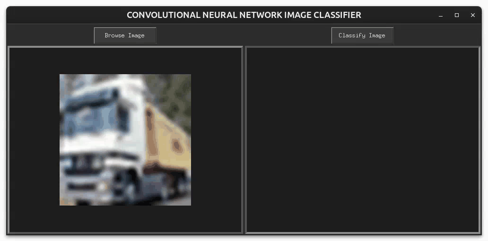

## CIFAR-10 Image Recognition Application using Convolutional Neural Networks

A simple and intuitive application that recognizes images from various everyday object categories using a Convolutional Neural Network (CNN). The model is trained on the CIFAR-10 dataset and features a user-friendly PyTkinter GUI for interaction.

## Features

    1. Image recognition powered by a Convolutional Neural Network trained with the Adam Optimizer.
    2. Utilizes the CIFAR-10 dataset, which contains 60,000 labeled images across 10 object classes.
    3. Built with a PyTkinter interface for ease of use and interaction.
    4. The neural network is implemented using PyTorch for efficient training and evaluation.

## Requirements

Make sure to install the following Python packages before running the app

    1. PyTorch
    2. Pillow
    3. torchvision
    4. opencv-python
